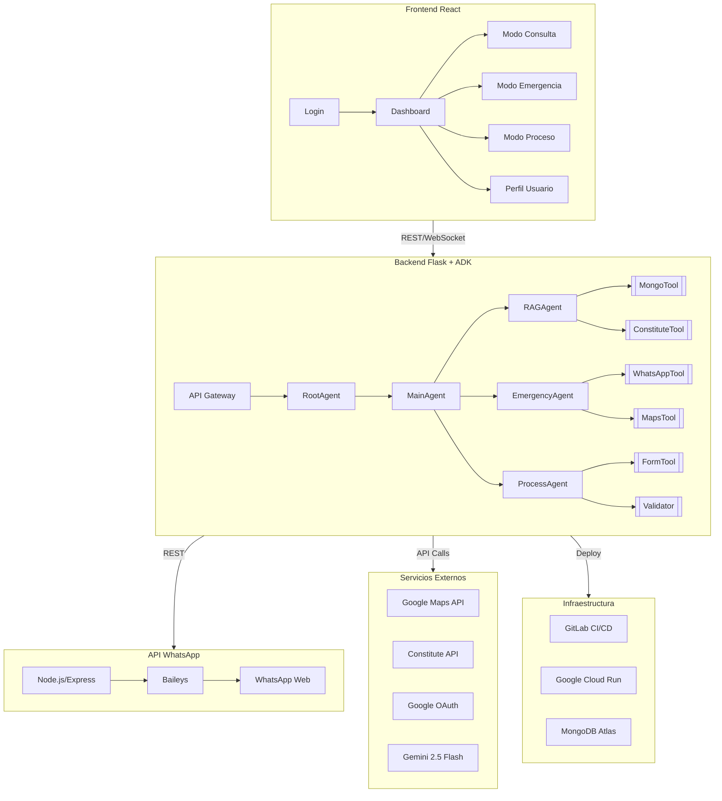
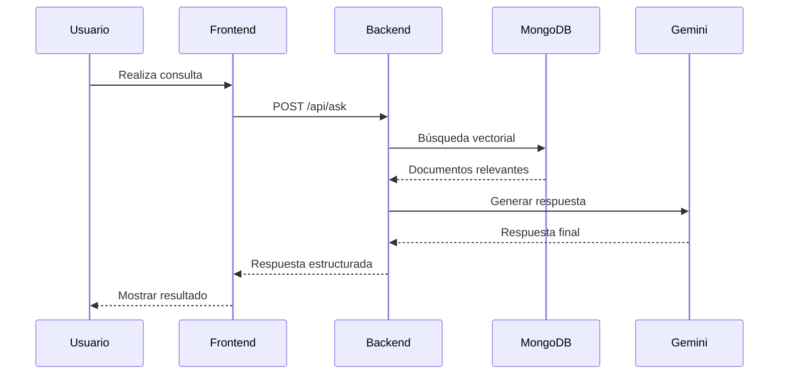
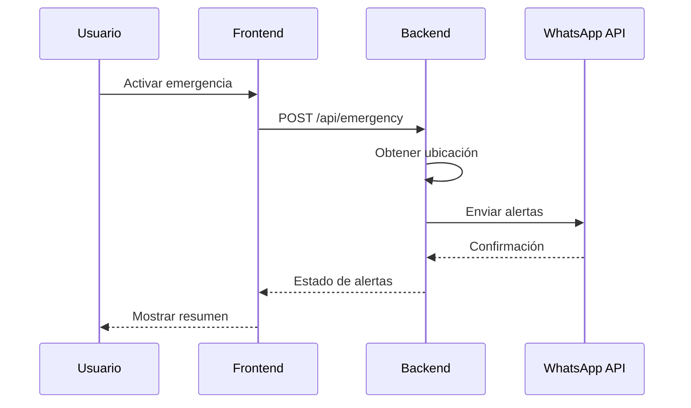

# LeFriAI - Plataforma Integral de Asistencia Legal


## Descripción

LeFriAI es una plataforma de asistencia legal que combina inteligencia artificial, procesamiento de lenguaje natural y mensajería instantánea para proporcionar acceso a la justicia de manera eficiente y accesible.

## Arquitectura



## Componentes Principales

| Componente | Tecnología | Responsabilidad |
|------------|------------|-----------------|
| Frontend | React + TypeScript | Interfaz de usuario y experiencia |
| Backend | Flask + ADK | Lógica de negocio y agentes IA |
| WhatsApp API | Node.js + Baileys | Comunicación por WhatsApp |
| Base de Datos | MongoDB Atlas | Almacenamiento y búsqueda vectorial |
| IA | Gemini 2.5 Flash | Procesamiento de lenguaje natural |

## Requisitos Previos

- Node.js 18+
- Python 3.11
- Docker
- Cuenta de Google Cloud Platform
- Cuenta de GitLab
- MongoDB Atlas
- API Keys para servicios externos

## Configuración Inicial

1. Clonar el repositorio:
```bash
git clone https://gitlab.com/lefriai/lefri.git
cd lefri
```

2. Configurar variables de entorno:
```bash
# Backend
cp backend/.env.example backend/.env
# Frontend
cp frontend/.env.example frontend/.env
# WhatsApp API
cp whatsapp/.env.example whatsapp/.env
```

3. Instalar dependencias:
```bash
# Backend
cd backend
python -m venv venv
source venv/bin/activate
pip install -r requirements.txt

# Frontend
cd ../frontend
npm install

# WhatsApp API
cd ../whatsapp
npm install
```

## Ejecución Local

1. Iniciar Backend:
```bash
cd backend
source venv/bin/activate
uvicorn app:app --reload --port 5000
```

2. Iniciar Frontend:
```bash
cd frontend
npm run dev
```

3. Iniciar WhatsApp API:
```bash
cd whatsapp
npm run dev
```

## Estructura de Carpetas

```
lefri/
├── frontend/           # Aplicación React
├── backend/           # Servidor Flask
├── whatsapp/         # API de WhatsApp
├── docs/             # Documentación
└── .gitlab-ci.yml    # Pipeline CI/CD
```

## Integración

### Flujo de Consulta Legal


### Flujo de Emergencia


## Despliegue

El proyecto utiliza GitLab CI/CD para el despliegue automático en Google Cloud Run. El pipeline incluye:

1. **Test**: Pruebas unitarias y de integración
2. **Build**: Construcción de imágenes Docker
3. **Deploy**: Despliegue en Cloud Run

### Configuración de Variables en GitLab

Configurar las siguientes variables en GitLab CI/CD:

- `GCP_SERVICE_ACCOUNT_KEY`: Clave de servicio de Google Cloud
- `ATLAS_URI`: URI de conexión a MongoDB
- `GEMINI_API_KEY`: Clave de API de Gemini
- `WHATSAPP_API_URL`: URL de la API de WhatsApp

## Contribución

1. Crear una rama para tu feature:
```bash
git checkout -b feature/nueva-funcionalidad
```

2. Realizar cambios y commit:
```bash
git commit -m "Agregar nueva funcionalidad"
```

3. Push a la rama:
```bash
git push origin feature/nueva-funcionalidad
```

4. Crear Merge Request en GitLab

## Licencia

Este proyecto está bajo la Licencia MIT. Ver el archivo `LICENSE` para más detalles.

## Créditos y Agradecimientos
- **Desarrollador Principal**: Jonnathan Peña
- **Patrocinadores**: 
  - WEBLIFETECH
  - Fundación Underlife
- **Contribuidores**: [Lista de contribuidores](CONTRIBUTORS.md)

**LeFriAI Team - Junio 2025**  
*Democratizando el acceso a la justicia con Inteligencia Artificial* 