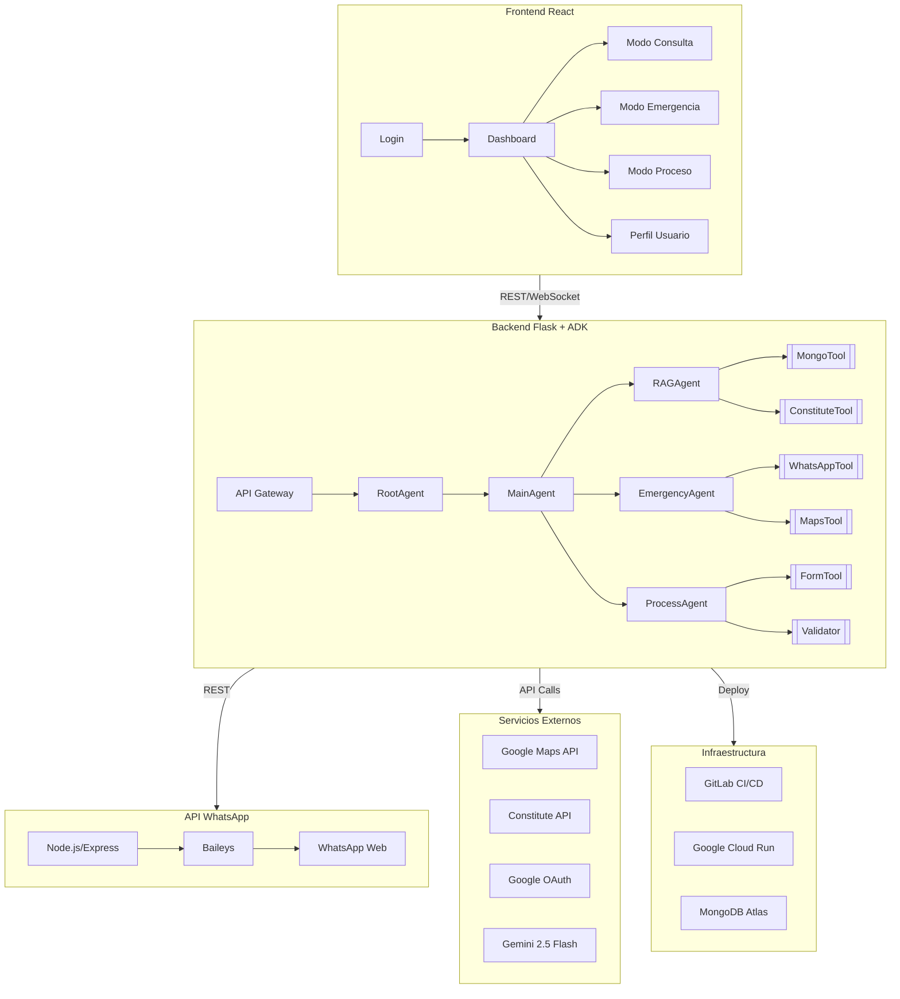
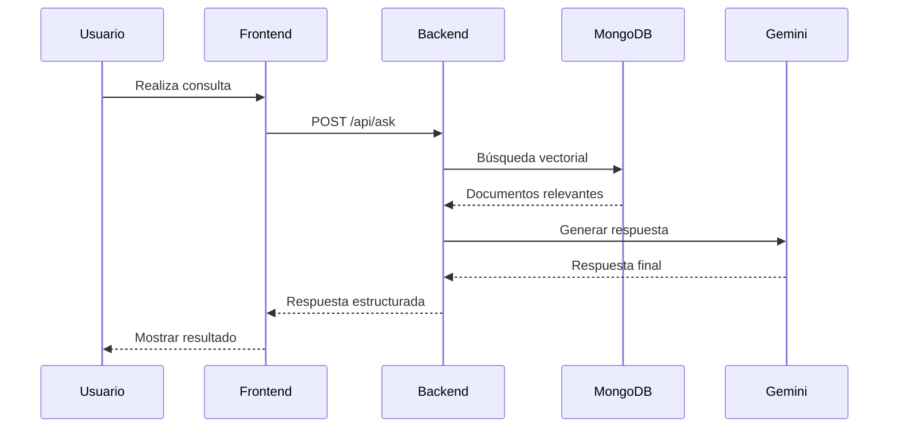
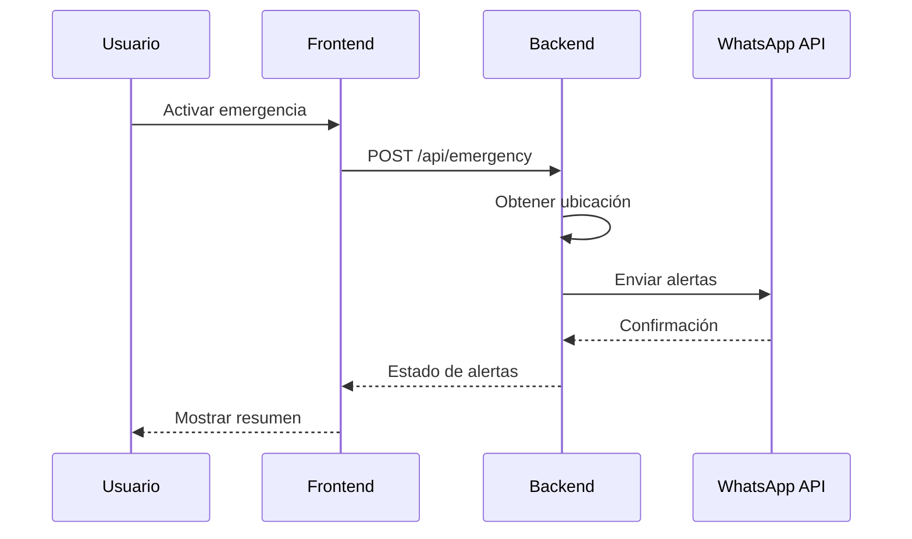

# Master Plan - LeFriAI (Junio 2025)

## Visión del Sistema

LeFriAI es una plataforma integral de asistencia legal que combina cuatro pilares fundamentales:

1. **Consultas IA**
   - Procesamiento de lenguaje natural con Gemini 2.5 Flash
   - Búsqueda vectorial en MongoDB Atlas
   - Respuestas contextualizadas por país
   - Citas y referencias legales automáticas

2. **Procesos Legales**
   - Guía paso a paso de procesos comunes
   - Generación de documentos legales
   - Validación de formularios
   - Seguimiento de progreso

3. **Alertas Emergencia**
   - Sistema de geolocalización
   - Notificaciones vía WhatsApp
   - Contactos de emergencia
   - Protocolos de seguridad

4. **Integración WhatsApp**
   - API dedicada para mensajería
   - Manejo de sesiones persistentes
   - Soporte multimedia
   - Escalabilidad horizontal

## Arquitectura Técnica



## Plan de Implementación

### Fase 1: Configuración Inicial (1 día)
- [x] Configurar repositorio GitLab
- [x] Implementar pipeline CI/CD
- [x] Configurar variables de entorno
- [x] Establecer estructura de carpetas
- [x] Configurar Dockerfiles

### Fase 2: Desarrollo Backend (2 días)
- [ ] Implementar agentes ADK
- [ ] Configurar MongoDB Atlas
- [ ] Integrar Gemini API
- [ ] Desarrollar endpoints REST
- [ ] Implementar WebSockets

### Fase 3: Desarrollo Frontend (2 días)
- [ ] Crear componentes React
- [ ] Implementar autenticación
- [ ] Desarrollar interfaces de usuario
- [ ] Integrar con backend
- [ ] Implementar PWA

### Fase 4: WhatsApp API (1 día)
- [ ] Configurar Baileys
- [ ] Implementar endpoints
- [ ] Manejar sesiones
- [ ] Integrar con backend
- [ ] Configurar despliegue

### Fase 5: Pruebas y Despliegue (1 día)
- [ ] Pruebas unitarias
- [ ] Pruebas de integración
- [ ] Pruebas de carga
- [ ] Despliegue en Cloud Run
- [ ] Monitoreo y logging

## Flujos Clave

### 1. Flujo de Consulta Legal


### 2. Flujo de Emergencia


## Infraestructura de Despliegue

### GitLab CI/CD Pipeline
```yaml
stages:
  - test
  - build
  - deploy

variables:
  PROJECT_ID: "lefri-ai-prod"
  REGION: "us-central1"

# Jobs para cada componente
test-frontend:
  stage: test
  script:
    - cd frontend
    - npm install
    - npm run test

test-backend:
  stage: test
  script:
    - cd backend
    - python -m venv venv
    - pip install -r requirements.txt
    - pytest

test-whatsapp:
  stage: test
  script:
    - cd whatsapp
    - npm install
    - npm run test

build-frontend:
  stage: build
  script:
    - cd frontend
    - npm run build

build-backend:
  stage: build
  script:
    - cd backend
    - python setup.py sdist

build-whatsapp:
  stage: build
  script:
    - cd whatsapp
    - npm run build

deploy:
  stage: deploy
  script:
    - gcloud run deploy
```

### Google Cloud Run Configuración
```yaml
# Configuración para cada servicio
services:
  backend:
    cpu: 2
    memory: 4Gi
    min_instances: 1
    max_instances: 10
    
  frontend:
    cpu: 1
    memory: 2Gi
    min_instances: 1
    max_instances: 10
    
  whatsapp-api:
    cpu: 1
    memory: 2Gi
    min_instances: 1
    max_instances: 5
```

## Equipo y Responsabilidades

| Rol | Responsable | Tareas Principales |
|-----|-------------|-------------------|
| Backend Lead | [Nombre] | Arquitectura, ADK, API |
| Frontend Lead | [Nombre] | UI/UX, React, PWA |
| DevOps | [Nombre] | CI/CD, Cloud Run |
| QA | [Nombre] | Testing, Seguridad |

## Próximos Hitos

1. **Sprint 1 (Semana 1)**
   - Configuración inicial
   - Desarrollo backend base
   - Implementación frontend básico

2. **Sprint 2 (Semana 2)**
   - Integración WhatsApp
   - Pruebas de integración
   - Despliegue inicial

3. **Sprint 3 (Semana 3)**
   - Optimizaciones
   - Documentación
   - Lanzamiento beta

## Licencia

Este proyecto está bajo la Licencia MIT. Ver el archivo `LICENSE` para más detalles. 